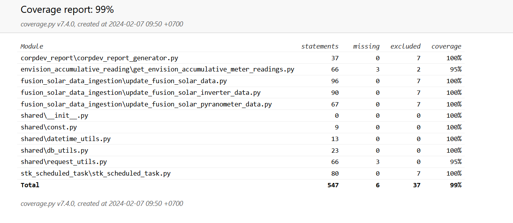

**Running scripts**
```
# go to the folder containing file you would like to run
python  <file-name>

# with stk_scheduled_task.py, using this one
python stk_scheduled_task.py [no_of_days]
```
**Running UT**
```
cd python_scripts
coverage run -m unittest
# need run one of two
coverage report -m --omit="tests/*"
coverage html --omit="tests/*"
```

**Code coverage result**
(python_scripts/htmlcov.rar)

